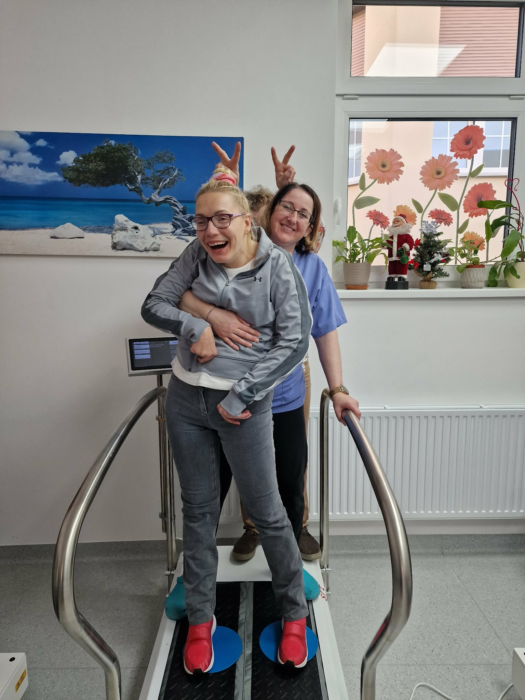
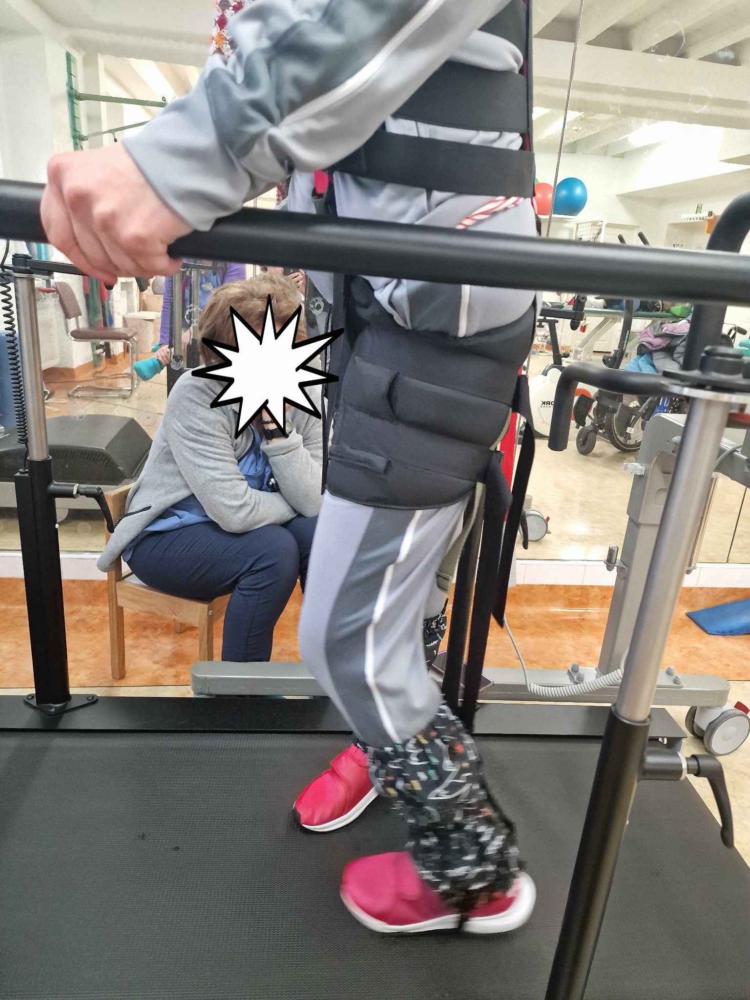
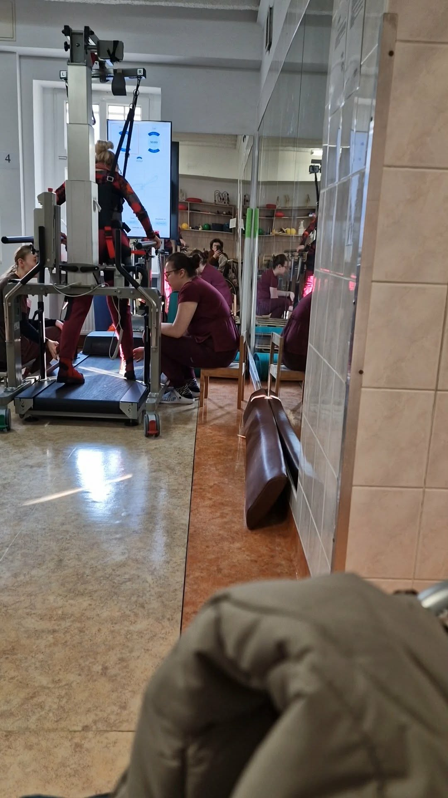
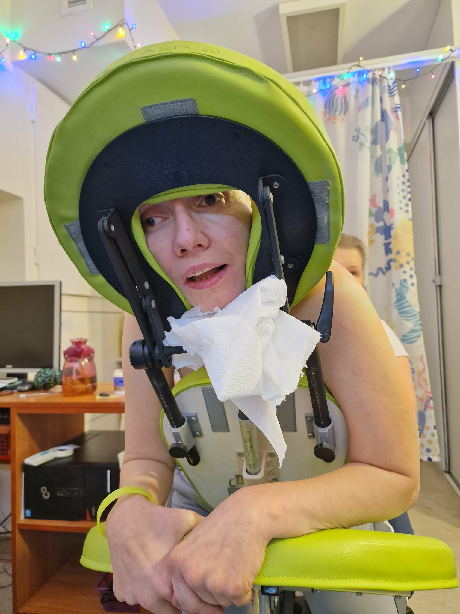

## Skrzydła na całe życie.

Od kilku lat o tej porze intensywnie przygotowuję się do światowego biegu.Biorę udział w Wings For Life World Run 2026 organizowanym w polskiej stolicy tej imprezy-w Poznaniu.10 mają  2026r. o godzinie 13-tej (czasu polskiego) startuje jednocześnie kilkaset tysięcy biegaczy na całej kuli ziemskiej.Po upływie 30 minut zawodników zaczyna gonić ruchoma meta-samochód pościgowy ,który w Poznaniu prowadzi Adam Małysz.

                          Mój aktualny trening wzmacnia mięśnie przy jednoczesnym ich rozciąganiu.

## 

Bardzo pomocnym urządzeniem jest platforma wibracyjna.Moje nadwyrężone mięśnie mają czas na regenerację.

Największym moim wyzwaniem fizycznym jest "spacer "po bieżni. Ustanawiany jest czas i prędkość tempa chodu.Dzisiaj pokonuję odległość 270 metrów w czasie 30 minut przy 3300 krokach.

Moja Gosieńka  masażystka -cudowne dłonie ,wycisza ból,który towarzyszy mi przewlekle.

Czas bezkarnie goni,moje skrzydła choć tak mocno przykurczone staram się rozwinąć.Popełniam krok do przodu,ale zdarza się i przestój. Nigdy się nie cofnęłam,choć czasami tak bardzo się chce!!!
